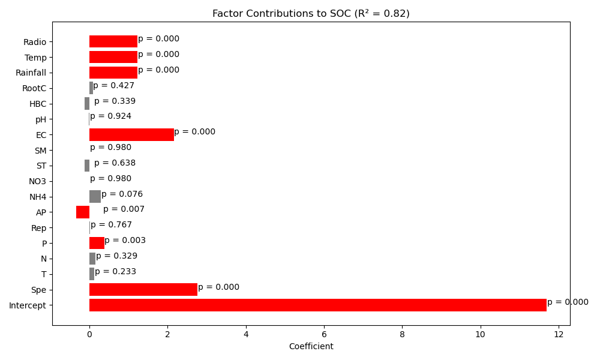
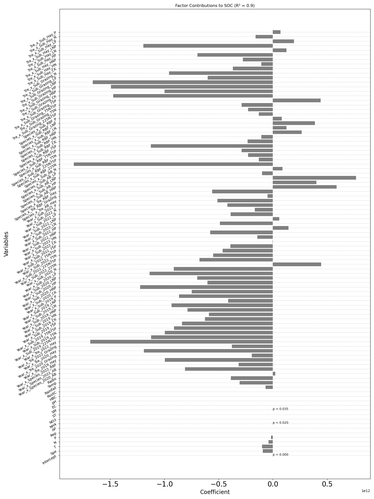

# Regression Analysis

This repository contains Python scripts for analyzing the effects of environmental factors and experimental grouping on Soil Organic Carbon (SOC) using multiple linear regression.

## 📦 Features

- Performs standard linear regression
- Supports feature scaling and standardization
- Generates interaction terms between experimental groupings
- Outputs coefficient estimates, p-values, and visualizations
- Saves detailed regression results and plots

## 🧪 Regression Models

### 1. Basic Linear Regression
Fits a multiple linear regression model using numeric environmental predictors (excluding group labels).

### 2. Standardized Regression
Same as above but uses `StandardScaler` to normalize inputs before regression.

### 3. Regression with Interaction Terms
Adds pairwise interaction terms between grouping factors (e.g., `Year x Species`) and includes them in the regression analysis after one-hot encoding.

## 📁 Files

- `regression_basic.py`: Linear regression without standardization or interactions
- `regression_standardized.py`: Includes feature standardization
- `regression_with_interactions.py`: Includes interaction terms with one-hot encoding
- `regression_results*.csv`: CSV outputs of regression coefficients and statistics
- `regression_plot*.png`: Visualizations of variable contributions

## 📊 Output Examples

- Bar plots of factor contributions to SOC
- Highlighted p-values (red for significant)
- Horizontal reference lines for readability

## 📂 Input

CSV file must include:

- `SOC`: target variable
- `Year`, `Species`, `Tre`, `Sub`: grouping variables
- Additional numeric columns: environmental factors

## 🧰 Installation

Install requirements with pip:

```bash
pip install -r requirements.txt
```
## Output



